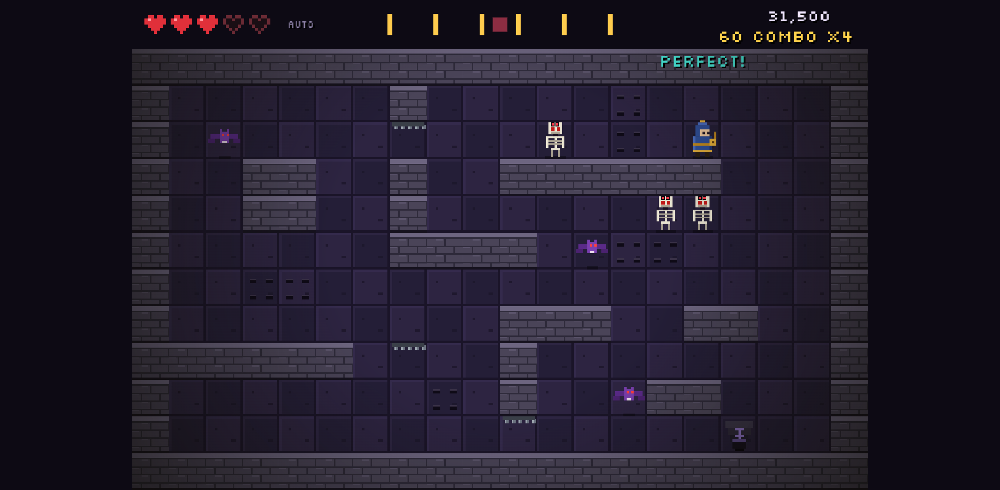

# Metronomicon

A rhythm dungeon crawler that runs in the browser. You move one tile per beat, and so does everything else in the crypt. Every key press is judged against the music.

**Play it:** https://marcozorn.github.io/Metronomicon/



## How to play

| Key | What it does |
| --- | --- |
| <kbd>←</kbd> <kbd>↑</kbd> <kbd>→</kbd> <kbd>↓</kbd> or <kbd>W</kbd><kbd>A</kbd><kbd>S</kbd><kbd>D</kbd> | Move one tile, on the beat. Move into an enemy to hit it. |
| <kbd>Space</kbd> | Tap along in the beat test and calibration screens |
| <kbd>Esc</kbd> | Back to the menu |

- Press **on the beat** and you move. Each press is rated **Perfect!** (within ±40 ms), **Good** (within ±100 ms) or **Miss**.
- A **Miss** makes you stumble: you lose a heart and your combo resets. Skipping a beat also resets your combo, but costs no heart.
- Your combo drives the music. At 4 the drums come in, at 12 the bass, at 24 the melody. It also raises the score multiplier, up to x4.
- **Bat:** flies one random tile every beat. **Skeleton:** walks toward you every 2 beats and raises its arms the beat before it moves. **Slime:** bounces up and down every 2 beats.
- **Spikes** are up on every other beat. **Gates** open for 2 beats, then shut for 2.
- The **stairs** unseal for the outro. Reach them before the song ends to escape. If the song ends first, you're trapped.
- You have 5 hearts. Your score and high score are saved in your browser.

Run **Calibrate** once before you play (see below).

## How timing works

- **Only the audio clock.** Every timestamp in gameplay comes from `AudioContext.currentTime`: key presses, the beat each move belongs to, and when enemies act. Nothing uses `Date.now()`, `performance.now()` or frame counts. `requestAnimationFrame` only redraws the screen. Music notes are scheduled ahead of time at exact AudioContext times; a `setInterval` lookahead only decides when to queue them.
- **Charts are written in beats.** The level ([`js/level.js`](js/level.js)) gives its map, enemy spawns and exit time in beats, plus a `bpm` and an `offset`. The only place beats are turned into seconds is `time = offset + beat * 60 / bpm` ([`js/timing.js`](js/timing.js)). The music, enemies, spikes and gates all go through that formula. Changing `bpm` or `offset` changes the whole level with it.
- **Judgement windows.** Each press goes to the nearest beat. The gap between them, `delta = press − beatTime`, is rated: `|delta| ≤ 40 ms` is Perfect, `≤ 100 ms` is Good, anything more is a Miss. You get one move per beat; a second press on the same beat counts as a Miss. The dungeon updates once per beat, just after that beat's Good window closes, so your move always lands before the enemies move.
- **Calibration offset.** Speakers, Bluetooth and keyboards all add delay. On the Calibrate screen you tap <kbd>Space</kbd> along to a click track for 16 beats. The median of your tap deltas becomes your offset in ms, and you can fine-tune it with <kbd>-</kbd> and <kbd>+</kbd>. It's saved in `localStorage` and subtracted from every press before judging: `judged = pressTime − offset`.
- There is a self-check for the timing math: `node test.mjs`. It covers beat→seconds conversion, the judge window edges and nearest-beat lookup.

## Music

The song, **"Crypt of Clocks"** (D minor, 120 BPM, 64 bars), is written for this game and synthesized live with Web Audio oscillators and noise ([`js/music.js`](js/music.js)). It contains no samples and no third-party recordings. It's split into stems: a base layer (kick + pad), drums, bass and melody. Your combo fades the stems in and out. Licence: same as the code (MIT). Use it however you like.

Font: [Silkscreen](https://fonts.google.com/specimen/Silkscreen) by Jason Kottke, SIL Open Font License.

## High score

**59,050**: 174 Perfects, 112 max combo, 13 kills. Set by the `?auto` bot, which still got flattened by slimes in the breakdown. Beat it.

## Run locally

It's static files with no build step:

```sh
python3 -m http.server 8000   # then open http://localhost:8000
node test.mjs                 # timing self-check
```

Add `?auto` to the URL to watch an auto-play bot (useful for screenshots).

## Files

- `js/timing.js`: beat↔seconds conversion, judge, median (pure functions)
- `js/audio.js`: AudioContext, synth voices, lookahead scheduler
- `js/music.js`: the song and its stems
- `js/level.js`: level 1, charted in beats
- `js/game.js`: the dungeon (input, judging, enemies, rendering)
- `js/sprites.js`: procedural pixel art
- `js/main.js`: screens (start, menu, beat test, calibration) and the main loop

MIT licensed.
